# Airin Masternode - VPS Installation - Multiple IPv4

This masternode installation script vastly simplifies the setup of a Airin masternode running on a virtual private server (VPS), and it also adds a number of other powerful features, including:

* Installs 1-3 Airin masternodes in parallel on one VPS, with individual airin.conf and data directories
* Support for multiple IPv4 Addresses - **Note: At this time Airin does not support IPV6 so IPV4 is enabled by default.**
* It can install masternodes for other coins on the same VPS as Airin
* 100% auto-compilation and 99% of configuration on the masternode side of things
* Automatically compiling from the latest Airin release tag, or another tag can be specified
* Some security hardening is done, including firewalling and a separate user, increasing security
* Automatic startup for all masternode daemons

Some notes and requirements:

* Script has only been tested on a Vultr VPS, but should work almost anywhere where IPV4 addresses are available
* Additional IPV4 addresses can be added for multiple masternodes on a single vps but this process must be manually configured
* Currently only Ubuntu 16.04 Linux is supported
* This script needs to run as root or with sudo, the masternodes will and should not!

This project was forked from https://github.com/masternodes/vps. @marsmensch (Florian) is the primary author behind this VPS installation script for masternodes. If you would like to donate to him, you can use the BTC address below

**Have fun, this is crypto after all!**

```
BTC  33ENWZ9RCYBG7nv6ac8KxBUSuQX64Hx3x3
```

# Install Guide on Vultr

## How to Get a VPS Server

For new masternode owners, **Vultr** is recommended as a VPS hosting provider, but other providers that allow direct root SSH login access and offer Ubunto 16.04 may work.

You can use the following referral link to sign up with Vultr for VPS hosting:

<a href="https://www.vultr.com/?ref=7422842"></a>

## Deploy a New System

First, create a new VPS by clicking that small "+" button.

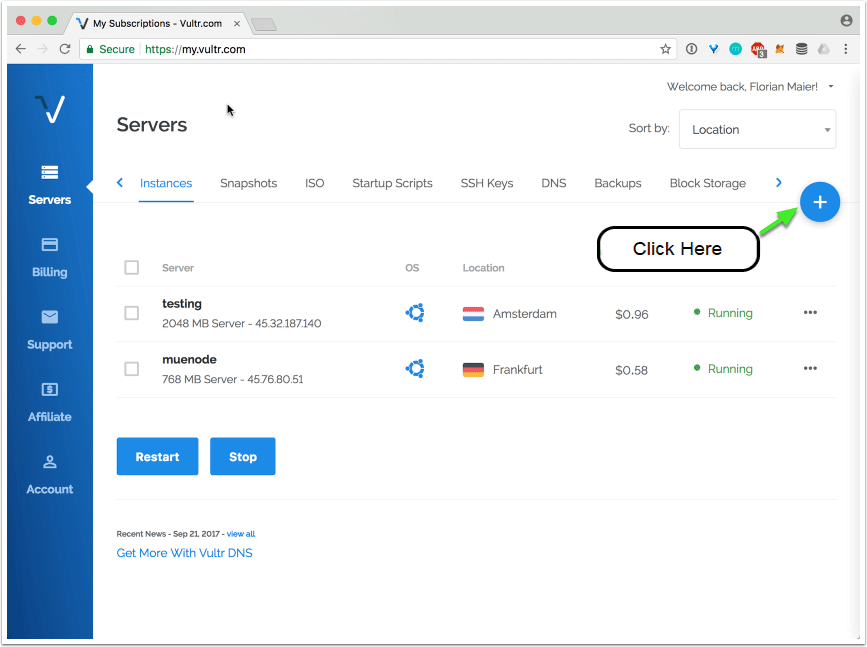

## Location Choice

You can choose any location. You may wish to have it hosted in a city/country near you, or choose a different area to help with the global decentralization of the Airin masternode network.


## Linux Distribution (Ubuntu 16.04 LTS)

Select Ubuntu 16.04.

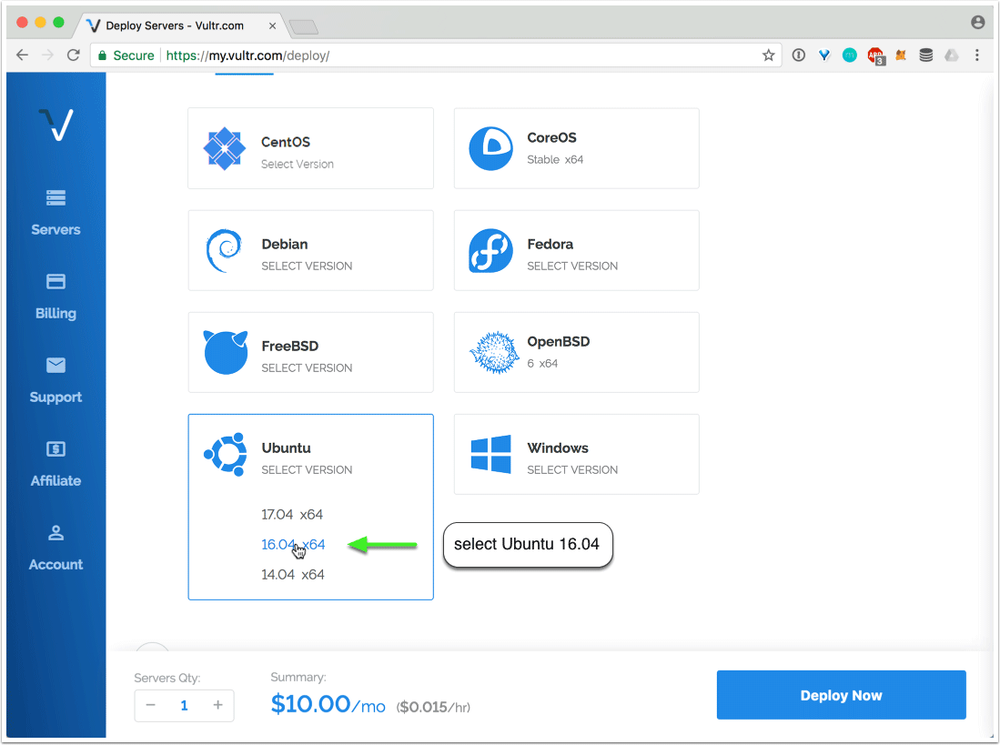

## VPS Size

The 25 GB SSD / 1024MBB Memory instance is enough for 2-3 masternodes. You may need more memory as the Airin blockchain grows over time, or if you want to run more masternodes.

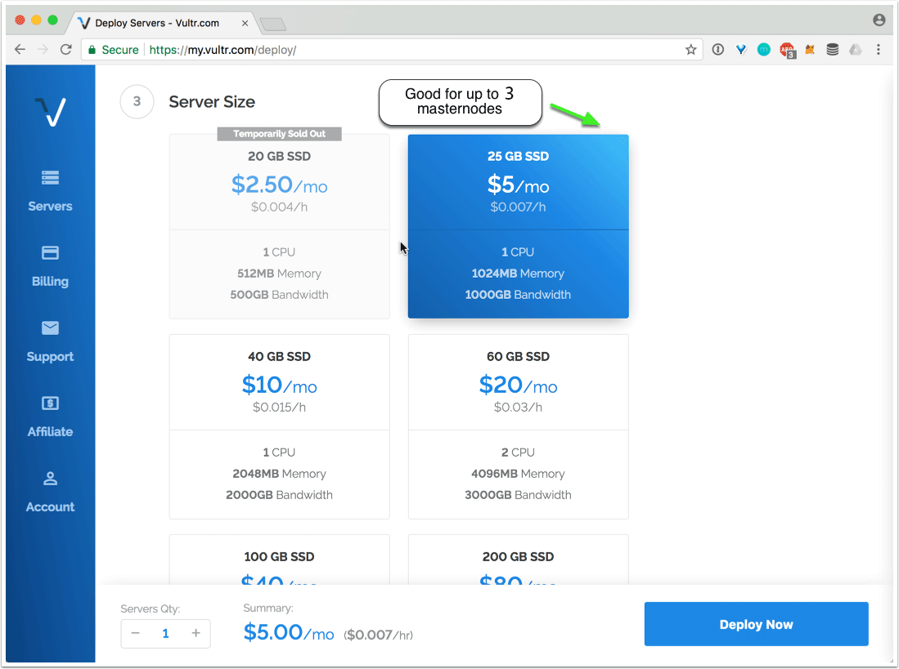

## Hostname

Choose 1 instance and click "Deploy Now".

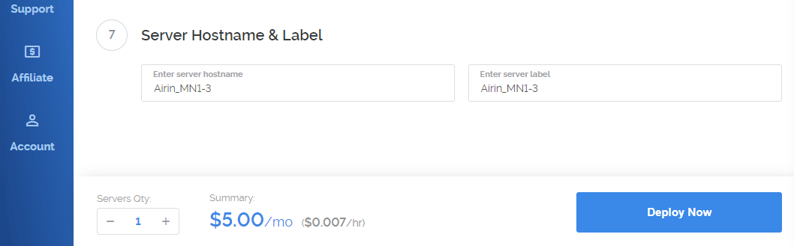

## Installation of PuTTY as SSH client (Windows)

If you are running your wallet from Windows, install PuTTY while the server is being set up. You can download PuTTY from here: http://www.putty.org/. Skip this step if you are using a Mac--you will use the built in Terminal application instead.

Once PuTTY is installed, return to the Vultr dashboard to get the login details by clicking on the ... to the right of your server, and select Server Details.

## Activating Additional IPv4 Addresses

Go to Settings on the server details page. The IPv4 section will appear. 

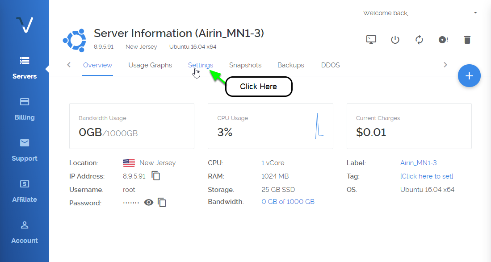

Click 'Add Another IPv4 Address'. When prompted, click 'Add IPv4 Address'.

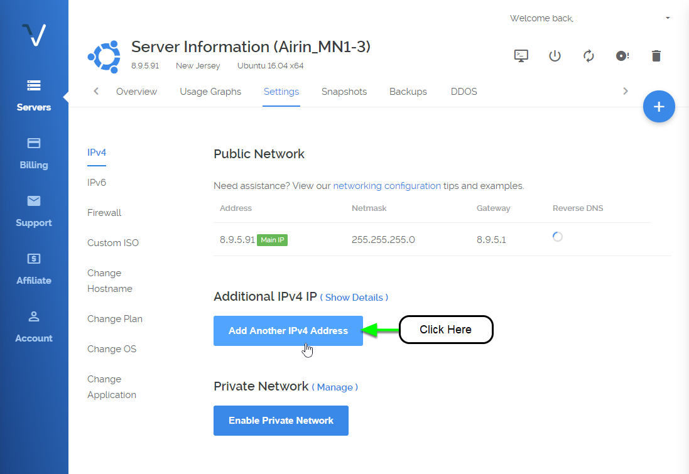
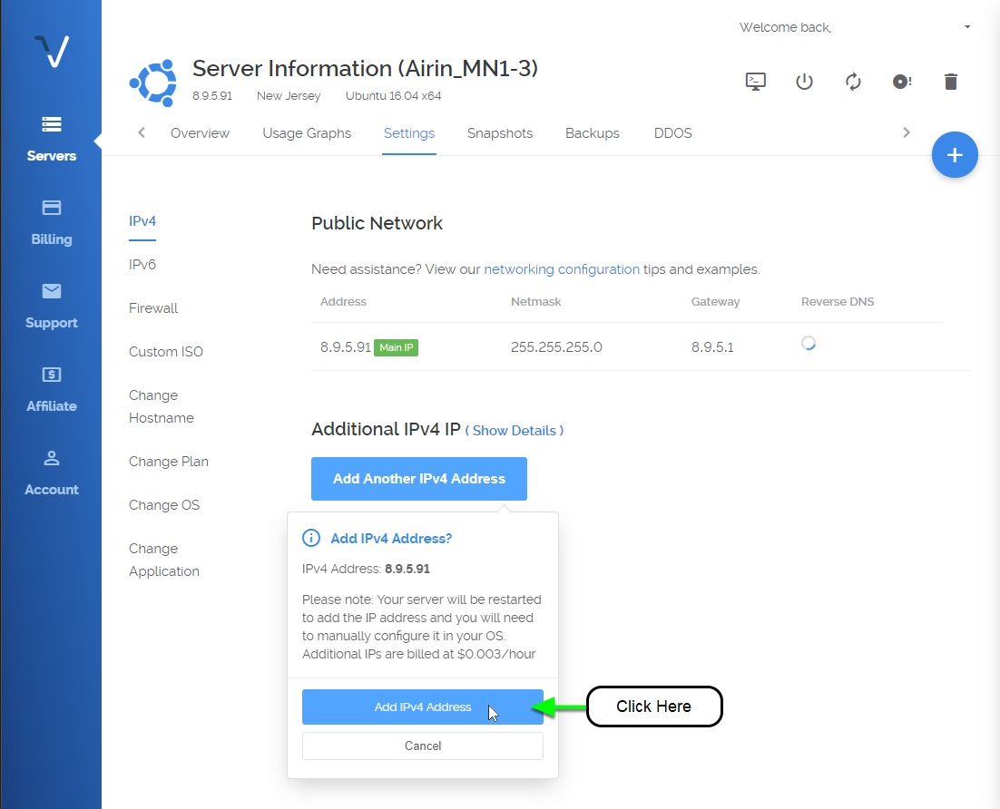

Repeat for each additional masternode. The maximum number of IPv4 addresses is 3 per VPS.

Note: There is an additional charge for each IPv4 address added. 

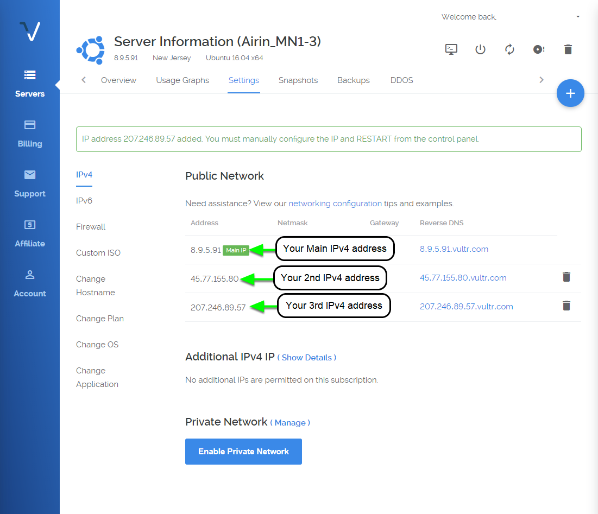

## Retrieve Networking Configuration

Click the networking configuration link located under the IPv4 section.

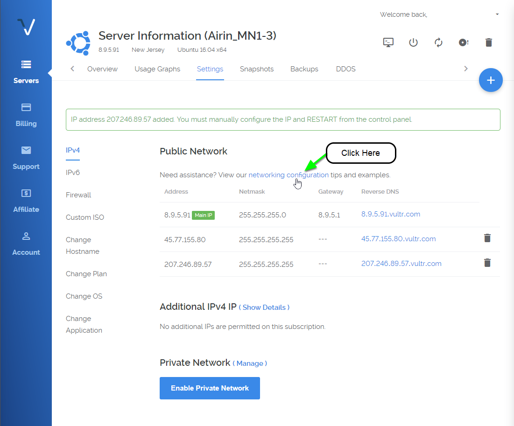

Scroll down to Ubuntu 16.xx, Ubuntu 17.04.

Select and copy the configuration text.

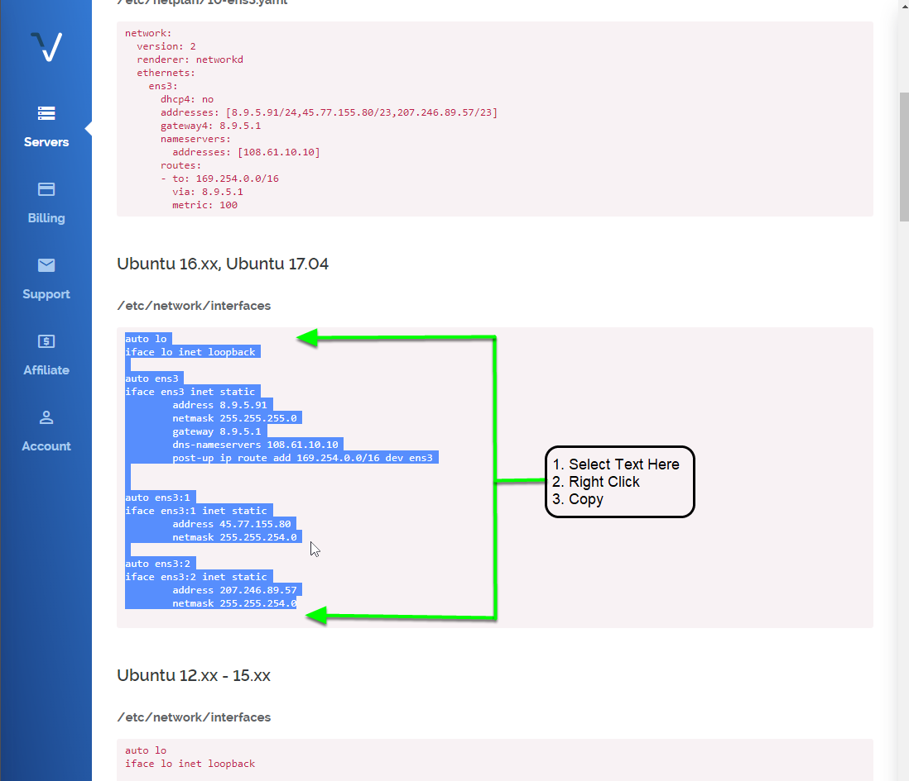

Paste the configuration shown into a text editor.

Save this for later. This will replace the /etc/network/interfaces configuration file on the vps.

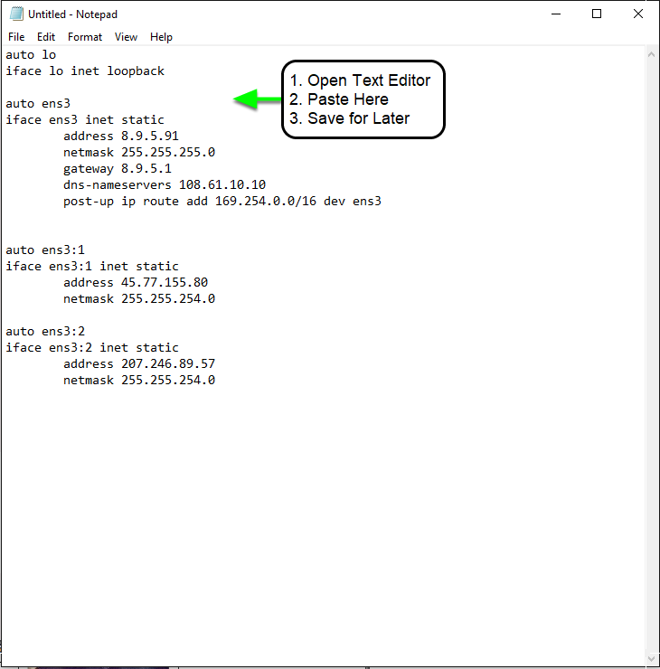

## Accessing your VPS via SSH

Go to Overview on the server details page.

Copy your password for SSH access from the server details page.

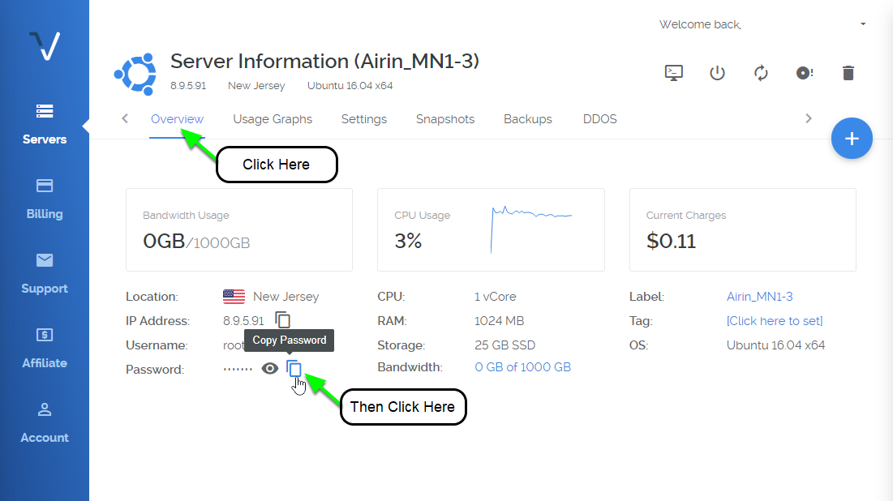

Now open PuTTY to add the server.

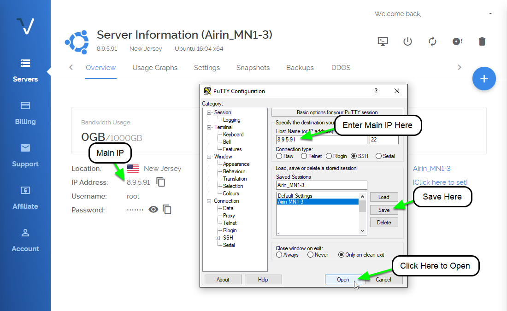

Enter the IP address in the Host Name field, and enter the server name you wish to use for this VPS (e.g., MN01) to Saved Sessions. Click save.

Click the open button. When the console has opened, click Yes in the PuTTY Security Alert box.

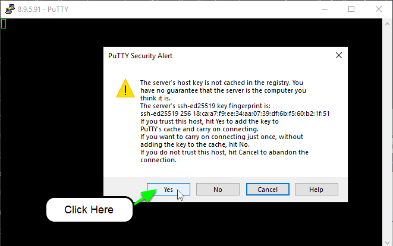

Now enter your server login details provided in your Vultr account.
You cannot Ctrl+V to paste in the console. Either right click the mouse or type shift+insert (sometimes
on keyboard it will just be INS key)

User: root
Password: (paste or type password)

When you paste it will not display, so don't try to paste again.
Just paste once and press Enter.

For Mac users, open Terminal (e.g., Press Command-Space and type Terminal and press Enter). Then type:

```
ssh -l root <IP address>
```

## Installation on VPS

Login to your newly installed node as "root".

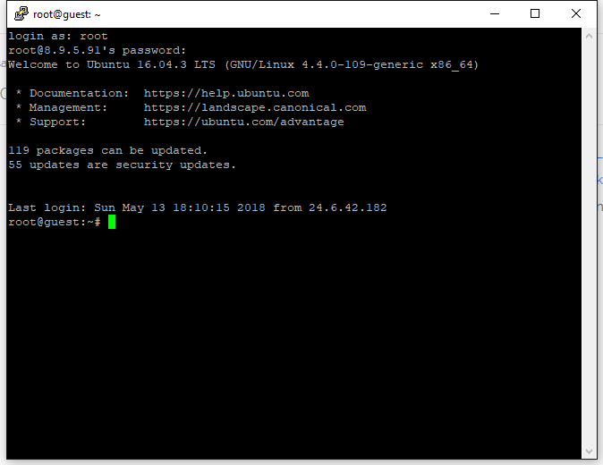

**Edit Network Interfaces**

```bash
nano /etc/network/interfaces
```

Delete each line shown. (Press Del Key)

Copy and paste the network configuration that was previously saved in the text editor. (from - 'Retrieve Networking Configuration' step)

Remember: You cannot Ctrl+V to paste in the console. Either right click the mouse or type shift+insert (sometimes
on keyboard it will just be INS key)

**Save and Close the File**

```
CTRL+X → Y → ENTER
```

**Configure Networking Changes**

```bash
ifup ens3:1
ifup ens3:2
```

**Clone the Github Repository to Install Masternodes**

```bash
git clone https://github.com/sdemmitt/vps.git && cd vps
```

**Install 3 Airin masternodes using IPv4 and configure sentinel monitoring:**

```bash
./install.sh -p airin -n 4 -c 3 -s 
```

## Additional examples

**Install 2 Airin masternodes using IPv4 and configure sentinel monitoring:**

```bash
./install.sh -p airin -n 4 -c 2 -s
```

**Install 1 Airin masternode using IPv4 and configure sentinel monitoring:**

```bash
./install.sh -p airin -n 4 -c 1 -s
```

## Options

The _install.sh_ script support the following parameters:

| Long Option  | Short Option | Values              | description                                                         |
| :----------- | :----------- | ------------------- | ------------------------------------------------------------------- |
| --project    | -p           | project, e.g. "pix" | shortname for the project                                           |
| --net        | -n           | "4" / "6"           | ip type for masternode. (ipv)6 is default                           |
| --release    | -r           | e.g. "tags/v3.0.4"  | a specific git tag/branch, defaults to latest tested                |
| --count      | -c           | number              | amount of masternodes to be configured                              |
| --update     | -u           | --                  | update specified masternode daemon, combine with -p flag            |
| --sentinel   | -s           | --                  | install and configure sentinel for node monitoring                  |
| --wipe       | -w           | --                  | uninstall & wipe all related master node data, combine with -p flag |
| --help       | -h           | --                  | print help info                                                     |
| --startnodes | -x           | --                  | starts masternode(s) after installation                             |

## Configure Airin Wallet
### A. Create Collateral Transaction
Once the wallet is open on your local computer, generate a new receive address and label it however you want to identify your masternode rewards (e.g., Airin-MN-1). This label will show up in your transactions each time you receive a block reward.

Click the Request payment button, and copy the address.


Now go to the Send tab, paste the copied address, and send *exactly* 10,000 PHR to it in a single transaction. Wait for it to confirm on the blockchain. This is the collateral transaction that will be locked and paired with your new masternode. If you are setting up more than one masternode at one time, repeat this process for each one.


### B. Generate Masternode Private Key
Go to the **[Tools > Debug Console]** and enter these commands below:

```bash
masternode genkey
```
This will produce a masternode private key:


Copy this value to a text file. It will be needed for both the airin configuration file on the masternode VPS, and the masternode configuration file on the computer with the controlling Airin wallet.

If you are setting up multiple masternodes, repeat this step for each one. Each time you run the masternode genkey command it will give you a new private key--it doesn't matter which one you use, but it is important that it is unique for each masternode and that the VPS airin configuration file and wallet masternode configuration file match (see below).

### C. Masternode Outputs

This will give you the rest of the information you need to configure your masternode in your Airin wallet--the transaction ID and the output index.

```bash
masternode outputs
```


The long string of characters is the *Transaction ID* for your masternode collateral transaction. The number after the long string is the *Index*. Copy and paste these into the text file next to the private key you generated in Step 2.

If you have multiple masternodes in the same wallet and have done the 10,000 PHR transactions for each of them, masternode outputs will display transaction IDs and indexes for each one. You can choose which private key to go with each transaction ID and index, as long as they are all different, and you make sure the corresponding lines in masternode.conf and the VPS airin configuration files match (see below).

## After Installation on VPS

After the masternodes have been installed on the VPS it will look similar to this: 

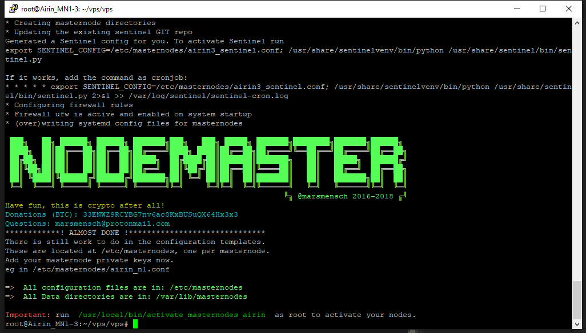

You only have a few steps remaining to complete your masternode configuration.
## Configure masternode configuration files
Since this installation method supports multiple masternodes, the airin configuration files have a node number added to them (e.g., airin_n1.conf, airin_n2.conf, airin_n3.conf), stored in the /etc/masternodes directory. If you have a single masternode on the VPS, you will only need to edit /etc/masternodes/airin_n1.conf.

### A. Edit Configuration File**

```bash
nano /etc/masternodes/airin_n1.conf
```

### B. Add IP**

Replace YOUR_VPS_IPV4_ADDRESS with ip address of your vps:

```
bind=YOUR_VPS_IPV4_ADDRESS:18808
```

### C. Add Private Key**

Replace YOUR_MASTERNODE_PRIVATE_KEY with your private key:

```
masternodeprivkey=YOUR_MASTERNODE_PRIVATE_KEY
```

### D. Save and Close the File**

```
CTRL+X → Y → ENTER
```

### E. Repeat Steps A - D**

For each additional masternode created, repeat steps A - D with the following changes:

* Replace 'airin_n1.conf' with 'airin_n2.conf' or 'airin_n3.conf'

* Use the added IPv4 addresses created in Vultr earlier for each added masternode. 

Note: IP addresses cannot not be used more than once.

### F. Restart VPS**

```bash
sudo reboot
```

## Start the Masternodes

After restarting the VPS server. Login to the VPS as root via SSH (Putty).

Activate the masternodes by running the following command:

```bash
/usr/local/bin/activate_masternodes_airin
```

The masternode daemons will start and begin loading the Airin blockchain.

## Finishing Wallet Configuration & Activate Masternodes
To activate your nodes from your wallet, one of the last steps is to add a line for the masternode in the masternode.conf file. This file has the following format, with each value separated with a space:

* alias IP:Port masternodeprivatekey collateral_transaction_ID collateral_output_index
* alias - A short name you use to identify the masternode, you can choose this name as long as it is without spaces (e.g., Airin-MN-1)
* IP:Port - The IP address (either IPv6 or IPv4) and the Port where the masternode is running, separated by a colon (:). You copied this from the airin.conf file on the VPS.
* collateral_transaction_ID: This is the transaction ID you copied from masternode outputs.
* collateral_output_index: This is the index you copied from masternode outputs.

From the wallet menu, edit the local wallet **masternode.conf** file. **[Tools > Open Masternode Configuration File]**
Add the MN conf line, like the example below to the masternode.conf file. Save it, and close the file. It will look like the following example, using your values for each of the fields above. A common mistake is mixing up the private key and the collateral transaction ID--to make this easier, the private key usually begins with an 8.

example.
```
Airin-MN-1 [2001:19f0:5001:ca6:2085::1]:11771 88xrxxxxxxxxxxxxxxxxxxxxxxx7K 6b4c9xxxxxxxxxxxxxxxxxxxxxxxxxxxxxxxxxxxxxxx7ee23 0
```

The image below shows another example using an IPv4 IP address. If you followed this guide you are probably using an IPv6 address that looks like the line above.

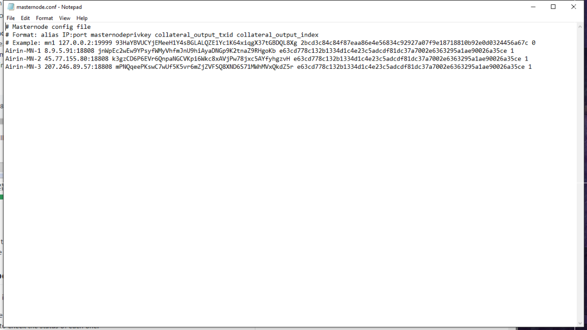

If you are running multiple masternodes, you need to add one of these lines for each masternode, and make sure the private key on each line matches the corresponding private key you entered in the VPS airin configuration file for that masternode.
## Check Status of Masternodes on the VPS

If you want to check the info of your masternode, the best way is currently running the cli e.g. for $AIRIN via

```
/usr/local/bin/airin-cli -conf=/etc/masternodes/airin_n1.conf getinfo

{
  "version": 120201,
  "protocolversion": 70206,
  "walletversion": 61000,
  "balance": 0.00000000,
  "privatesend_balance": 0.00000000,
  "blocks": 8679,
  "timeoffset": 0,
  "connections": 19,
  "proxy": "",
  "difficulty": 45.94715393716314,
  "testnet": false,
  "keypoololdest": 1526099573,
  "keypoolsize": 1001,
  "paytxfee": 0.00000000,
  "relayfee": 0.00010000,
  "errors": ""
}
```

To retrieve masternode status:

```bash
/usr/local/bin/airin-cli -conf=/etc/masternodes/airin_n1.conf masternode status
```

## Troubleshooting

The rpcport used in airin_n1.conf (airin_n2.conf, airin_n3.conf) files must be unique. Increase the port number +1 if any values match across each masternode. 

## Issues and Questions
Please open a GitHub Issue if there are problems with this installation method. Check the Airin Discord channel for support or assistance.
Here is a Discord invitation:

https://discord.gg/6emAcHj